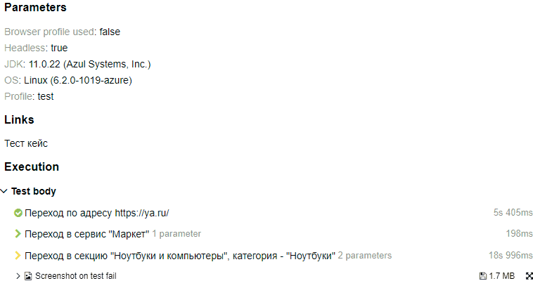
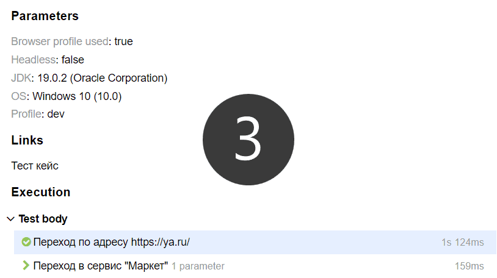

## Автоматизация тест-кейса ЯндексМаркета
Автоматизация на связке Maven, Selenium, JUnit5, Allure.
Документация на русском языке - согласно требованиям.
## Содержание
- [Build](#build)
    - [Запуск тестов](#запуск)
    - [Сгенерировать отчет](#сгенерировать-отчет)
- [Allure отчет](#allure-отчет)
    - [Запуск и деплой отчета в CI](#запуск-тестов-в-ci-и-деплой-отчета-джобой-github-actions)
    - [Запуск локально и деплой отчета "руками"](#запуск-тестов-локально-и-деплой-отчета-руками)
- [Требования](#требования)
    - [Тест кейс](#тест-кейс)
    - [Стек](#стек)
    - [Прочее](#прочее)

## Build
В окружении должна быть установлена (и прописана в PATH) java не ниже 11 версии
и добавлена переменная среды JAVA_HOME.
#### Запуск:

    ./mvnw verify -DuseBrowserProfile=false

#### Сгенерировать отчет:
- Если в окружении Allure не установлен:

      ./mvnw allure:install
      ./mvnw allure:serve

- Если в окружении Allure установлен (2.24.0 и выше):

      cd ./target
      allure serve

## Allure отчет

### Запуск тестов в CI и деплой отчета джобой (GitHub Actions)

При запуске в CI бороться с капчами сложнее, поэтому 
[результат](https://achitheus.github.io/SeleniumTestCaseYandexMarket/)
оставляет желать лучшего:

---

---
Как ни странно, могло быть и хуже (см. заметку 
<ins>[Удаленное противо-captcha-стояние](https://github.com/Achitheus/automationCucumber/blob/main/NOTES.md#удаленное-противо-captcha-стояние)<ins>).

### Запуск тестов локально и деплой отчета руками
Здесь руки не так связаны, поэтому <ins>[результат](https://achitheus.github.io/SeleniumTestCaseYandexMarket/local-run)</ins>
соответствующий:

---

---

## Требования
### Тест-кейс
1. Открыть браузер и развернуть на весь экран.
2. Зайти на https://ya.ru/
3. Нажать слева внизу на значок "все сервисы" -> Кликнуть по "Маркет"
4. Перейти в Каталог -> Навести курсор на раздел "Ноутбуки и компьютеры"
5. Выбрать раздел "Ноутбуки"
6. Задать параметр «Цена, Р» от 10000 до 900000 рублей.
7. Выбрать производителя "Huawei" и "Lenovo"
8. Дождаться результатов поиска.
9. Проверить, что на странице отображалось более 12 элементов.
10. Проверить что на всех страницах предложения соответствуют фильтру.
11. Вернуться на первую страницу с результатами поиска ноутбуков и запомнить первое наименование ноутбука.
12. В поисковую строку ввести запомненное значение.
13. Нажать кнопку «Найти»
14. Проверить, что в результатах поиска есть искомый товар
## Стек
Java, Junit Jupiter, Selenium, PageObject или PageFactory  

### Прочее
- [x] Тест разбит на шаги. Коллега без знаний программирования по аллюр отчету должен понимать что делает тест, какие проверки происходят
- [x] Тест должен быть параметризован
- [x] Необходимо использовать константы через проперти файл
- [x] Все ассерты должны быть переопределены (все проверки, в том числе и "passed", отражены в отчете)
- [x] Трай\кетчи не должны быть использованы для реализации логики
- [x] Если в коде используются циклы, необходимо исключить возможность бесконечного цикла
- [x] Обязательно использовать Джава док для всех методов и переменных. На русском языке
- [x] Недопустимо использования Thread.sleep и Трай\кетчи. За исключением, создания собственных ожиданий (к примеру каждый 5 миллисекунд проверяем что что-то случилось, и так не более 10 секунд.). Лучше обойтись явными\неявными ожиданиями
- [x] Помнить про универсальные методы. Писать код, полезный в других тестах, полезный коллегам.
- [x] XPath не должен содержать индексов, динамических элементов
